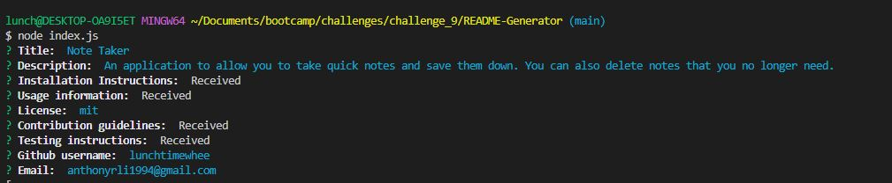
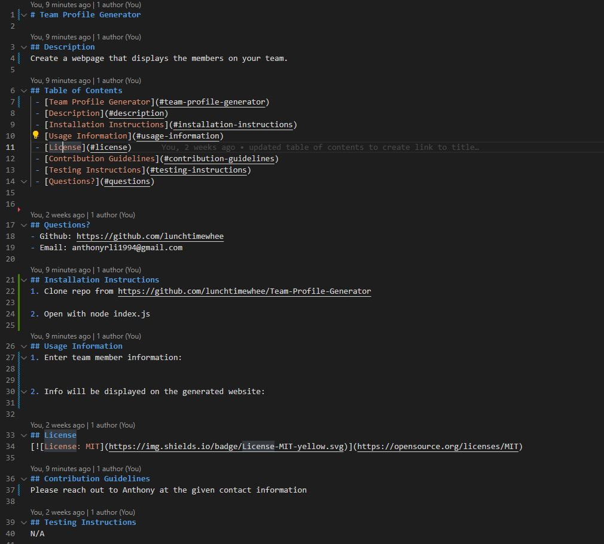

# README Generator

## Description
A template program used to create a README for all of your coding projects.

## Table of Contents
 - [README Generator](#readme-generator)
 - [Description](#description)
 - [Installation Instructions](#installation-instructions)
 - [Usage Information](#usage-information)
 - [License](#license)
 - [Contribution Guidelines](#contribution-guidelines)
 - [Testing Instructions](#testing-instructions)
 - [Questions?](#questions)

## Installation Instructions
1. Run npm install to update dependencies
2. Open up the command line and run "node index.js"

## Questions?
- Github: https://github.com/lunchtimewhee 
- Email: anthonyrli1994@gmail.com

## Usage Information
Video: https://app.castify.com/watch/91f3f42d-f894-4a4d-b4a4-d040b75231d4

1. Prompts will start as soon as the program is run.
[]

2. Enter in answers to all of the prompts and a README will be generated based off of those answers.
[]

## License

## Contribution Guidelines
Reach out to Anthony Li at any of the given contact information in the "Questions?" section.

## Testing Instructions
N/A

